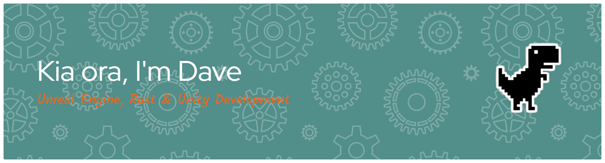

<p align="center">
  
</p>

---

<h2> 👨🏻‍💻 &nbsp;A Little Bit About Me and My Interests</h2>

```yaml
name: David Hocking
located_in: Auckland | New Zealand
current_job: Part Time Outdoor Adventure Lead
education:
  [
    "AUT University",
    "Graduate Diploma in Computer and Information Sciences"
  ]

fields_of_interests:
  [
    "Rust Community Projects",
    "Indie Game Development"
  ]

hobbies:
  [
    "Gaming",
    "Running",
    "Food"
  ]
```

---  
  
<h2 align="center"> 🚀 &nbsp;Tools of the Trade</h2>
<p align="center">


</p>

---

<p align="center">
  
</p>
